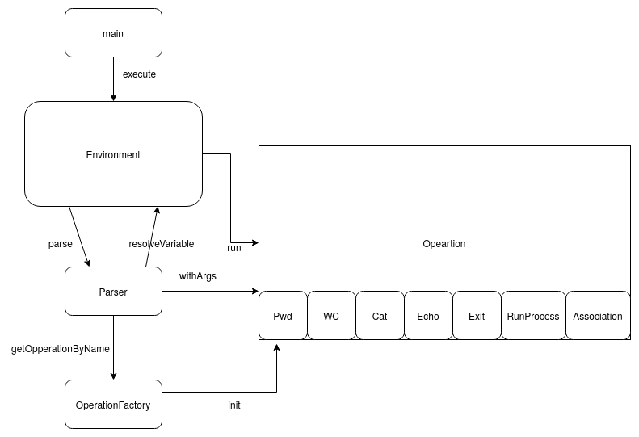

## CLI bash simulator

`./gradlew run`

#### `Environment`
класс окружения. Хранит переменные, обращается к файлам. Создает парсер и фабрику команд, обращается к парсеру для разбора ввода из командной строки.
#### `Parser` 
получает из входной строки команды в порядке выполнения. Разбивает вход на команды по пайплайнам. Обращается к окружению для подстановки переменных и фабрике для создания команд.
#### `Operation` 
`WC`, `Echo`, `Pwd`, `Cat`, `Exit`, `RunProcess`, `Association` -- все наследники\
 родительский класс для всех bash команд. Предоставляет интерфейс для добавления агрументов и запуска.
#### `OperationFactory`
фабрика объектов команд. В текущей версии только создает по текстовому обозначению команды инстанс для своего окружения.

### Key Parsing Library

Рассматривались варианты
* kotlinx.cli 
* kotlin-argparser
* Clikt 
* picocli  

Выбран последний, потому что у него больше всего звездочек на гитхабе.\
Еще там есть подробная документация, и для определения используются аннотации.
Из всех предложенных способов так выглядит наиболее просто читаемо.

